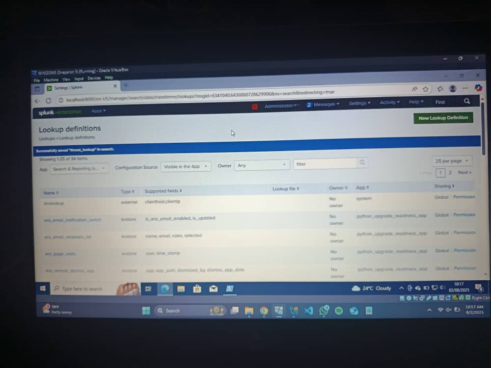
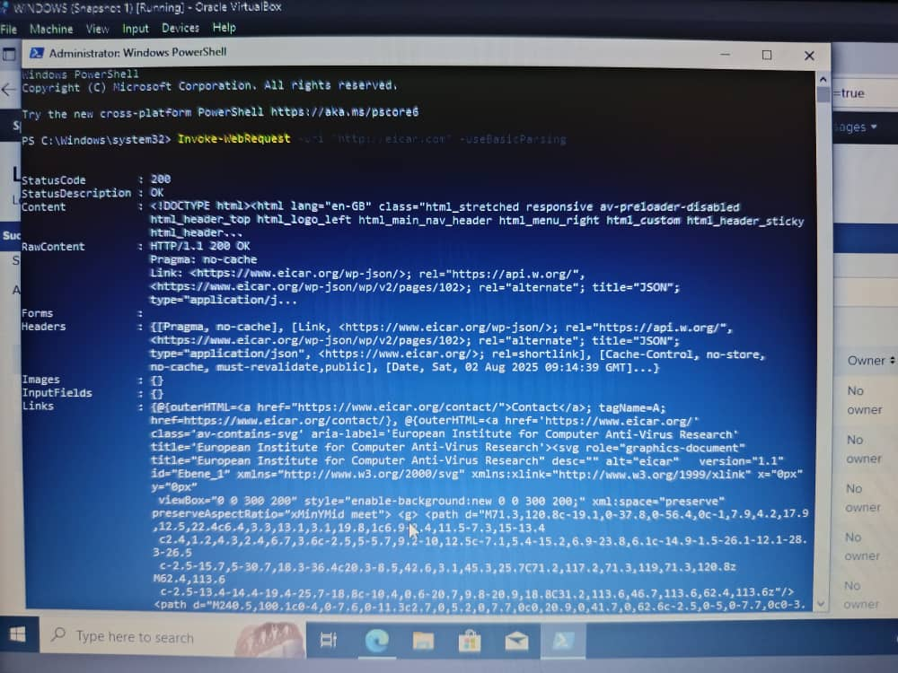

# Threat Intelligence Correlation in Splunk

This project demonstrates how to ingest and correlate external threat intelligence (IOCs) with endpoint logs using Splunk and Sysmon.

## Project Goals

- Understand threat intel feeds
- Build lookup-based correlation in Splunk
- Detect malicious IPs and domains in logs
- Create alerts and dashboards for IOC matches

## IOC Types Used

- Malicious IPs
- Phishing domains
- Suspicious URLs

## steps

-  Collection of Threat Intelligence IOCs
-  Upload the CSV File into Splunk
-  Simulation of Suspicious Activity in Windows
-  Write a Correlation Search in Splunk
-  Save Search as an Alert
-  Create a Dashboard for IOC Hits

  ---

## Outcome

 Alerts trigger when known IOCs are found in process or network logs. Analysts can visualize IOC matches via dashboards for better triage.

##  <a href="https://github.com/Ibrahim-Ajao/reports-correlation_summary_report.md">Final Report</a>
 
---
## pictures 

 
## IOCs collection sites

---
 
## creating lookup defination in splunk to upload the CSV file

---

## Using PowerShell to visit a known IOC
 

